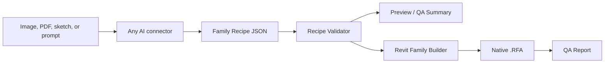

# Opportunity Brief: Symetri Family Forge

Status: Candidate
Owner: Gerardo Ruiz-King
Date Created: 2026-06-24
Last Updated: 2026-06-24
Artifact Library Reference: `P:\_IRIS-Artifact Library\06_Prototype_Tools\Symetri_Family_Forge`
Opportunity Category: Internal Service Accelerator / Client-Facing Toolkit Candidate
Internal Priority: High

## Summary

Symetri Family Forge is a connector-agnostic workflow for generating clean, native Revit families from images, sketches, product data sheets, and text descriptions.

The core idea is to avoid letting an AI tool write directly into Revit. Instead, any AI connector produces a structured family recipe. A Symetri-controlled validator and Revit builder then turn that recipe into a native `.rfa` with reference planes, parameters, organized geometry, materials, and a QA report.

This makes the workflow inspectable, repeatable, and not tied to Claude, ChatGPT, Gemini, Copilot, or any single model provider.

## Problem

Revit family creation is valuable but expensive, inconsistent, and often bottlenecked by specialized BIM staff. Many teams need reasonable project-ready content from product photos, cutsheets, sketches, and design intent faster than they can manually model it.

Current AI experiments are promising, but they often blur together three separate responsibilities:

- Interpreting the design intent.
- Deciding the BIM structure.
- Creating native Revit geometry.

That creates risk. The AI may invent dimensions, produce unsupported geometry, skip parameters, or create content that looks correct but fails BIM quality expectations.

## Target Users

- Symetri consultants producing families for clients.
- BIM managers who need repeatable content creation workflows.
- Architects and designers who need draft families from product references.
- Internal IRIS teams building service accelerators.
- Future client-facing users, once validation and guardrails are mature enough.

## Current Workflow

Typical family creation requires a BIM specialist to interpret product information, choose a template, create reference planes and parameters, model geometry, assign materials, flex the family, test placement, and package the output.

AI-assisted experiments can accelerate interpretation, but the handoff into Revit is usually fragile unless the output is normalized into a strict schema.

## Proposed Improvement

Use a three-part pipeline:

1. AI connector creates a family recipe from images, PDFs, sketches, or prompts.
2. Symetri Family Forge validates and previews the recipe.
3. A Revit add-in builds the native family from the approved recipe.

The AI output remains editable JSON. Every step is inspectable.



## Product Shape

### Internal Service Accelerator

This should be the first launch mode.

Symetri receives client source material, generates and reviews a recipe, builds the family, and delivers a QA-backed Revit family. This creates immediate service value while keeping a human BIM expert in the approval loop.

### Client-Facing Toolkit

This is a later mode after enough recipes, QA checks, and failure cases are known.

A client uploads source material, answers clarifying questions, reviews a browser preview, and exports a family. The tool still uses the same schema and validator, but requires stronger guardrails, UI, support workflows, and usage boundaries.

## Expected Value

- Faster first-pass family creation.
- Less dependency on one specialist doing every modeling step manually.
- Better consistency through schema-driven parameters and QA.
- Reusable prompt packs for any AI connector.
- A repeatable service offering under Symetri.
- A path toward productization without locking into a single model provider.

## Existing Materials

Initial references include screenshots and notes from image-to-model and AI-to-Revit-family experiments, including workflows where an AI creates a JSON description and a Revit add-in builds the resulting family.

Planned operational home:

```text
P:\_IRIS-Artifact Library\06_Prototype_Tools\Symetri_Family_Forge
```

## Risks and Constraints

- AI may infer dimensions that are not present in source material.
- Generated content may look correct but fail Revit family quality expectations.
- Hosted families, MEP connectors, adaptive components, and complex constraints are higher risk than simple furniture or generic models.
- Native Revit API family creation requires strict template, transaction, and parameter handling.
- Client-facing use needs clear disclaimers and QA gates.
- The schema must stay provider-neutral and versioned.

## Pilot Potential

Recommended first pilot:

- Category: Furniture or Generic Models.
- Hosting: Non-hosted generic or face-based only after non-hosted is stable.
- Geometry: Rectangular extrusions, voids, simple cylinders, shelves, panels, handles, legs, and repeated arrays.
- Inputs: Product image plus dimensions, or PDF cutsheet plus prompt.
- Output: Native `.rfa`, recipe JSON, validation summary, and QA report.

## Open Questions

- Which family categories produce the best early business value?
- Should the first builder be a Revit add-in command, an external event service, or a Dynamo-compatible bridge?
- How much browser preview is needed before the Revit builder exists?
- What should be required before a recipe can be marked "client deliverable"?
- Should approved recipes become reusable Symetri content templates?

## Recommended Next Step

Build the MVP around a wardrobe/cabinet/table class:

- Finalize the v0.1 recipe schema.
- Create prompt packs for Claude, ChatGPT, Gemini, Copilot, and generic OpenAI-compatible connectors.
- Build a local recipe validator.
- Build a Revit add-in command that reads a validated recipe and creates first-pass native geometry.
- Run three sample family pilots and document the QA gaps.

