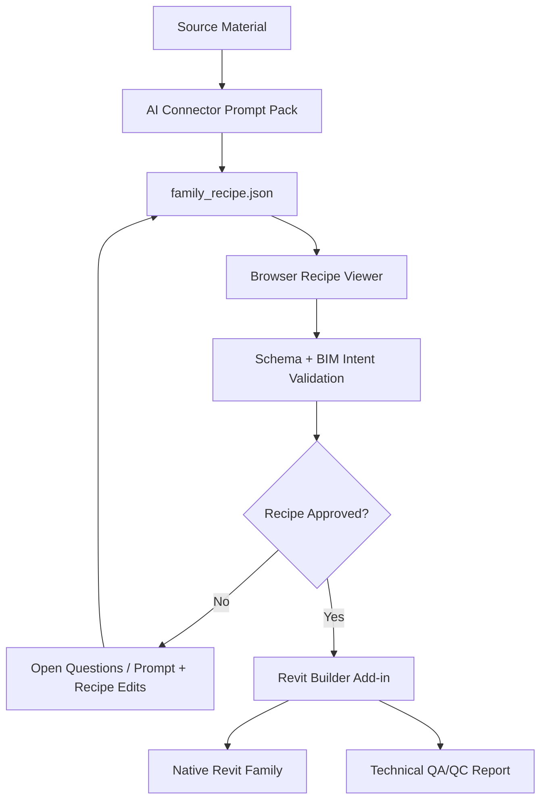

# Symetri Family Forge Architecture

## Design Principles

- Connector-agnostic: any AI system can participate if it can output the recipe schema.
- Inspectable: the AI output is plain JSON and can be reviewed before Revit work begins.
- BIM-first: native Revit behavior matters more than visual novelty.
- Human-approvable: the system should ask questions instead of inventing critical dimensions.
- Versioned contract: recipes declare a schema version so builders can evolve safely.

## Pipeline

## Components

### AI Connector

The AI connector may be Claude, ChatGPT, Gemini, Copilot, an OpenAI-compatible local model, or a future internal Symetri connector. The connector only needs to produce JSON matching the recipe schema.

The connector must not be treated as the system of record. Its output is draft intent until validation and review are complete.

### Recipe Schema

The schema is the central contract. It describes:

- Family identity and category.
- Hosting behavior.
- Units.
- Parameters.
- Family authoring strategy.
- Reference plane strategy.
- Parameter association strategy.
- Reference planes.
- Materials.
- Nested family candidates.
- Visibility/detail-level strategy.
- Publishing QA checklist.
- Geometry primitives.
- Constraints.
- Source assumptions.
- Clarifying questions.
- QA status.

### Validator

The validator checks structural correctness and BIM-oriented rules before Revit receives the recipe.

Early validation examples:

- Required dimensions exist.
- Unsupported geometry types are rejected.
- Critical inferred dimensions are flagged.
- Parameter names are valid and unique.
- Materials referenced by geometry exist.
- Hosted behavior is supported by the selected template.

### Browser Recipe Viewer

The browser viewer is the preferred place to validate model intent before creating a Revit family. It should preview the JSON geometry, expose editable parameters, show open questions, and separate recipe/model issues from Revit builder limitations.

The viewer should produce a recipe feedback report that answers:

- What questions must be resolved before build.
- Which dimensions, proportions, materials, or hosting assumptions were inferred.
- Which prompt instructions should be added before regenerating JSON.
- Which geometry is intentionally approximate because the builder does not support the ideal Revit primitive yet.

This prevents the Revit add-in from becoming the primary place for design-intent review. Once the viewer exists, Revit-side reporting should focus on technical QA/QC of the generated family.

### Revit Builder

The Revit builder consumes an approved recipe and creates native family content. The initial builder should prioritize a small, reliable set of primitives:

- Extrusions.
- Void extrusions.
- Cylinders and sweeps, if needed.
- Material parameters.
- Family parameters.
- Reference planes.
- Basic constraints.

The first implementation can be a Revit add-in command named `Build Family From Recipe`.

Future builder work should align with [Revit Family Best Practices](revit-family-best-practices.md). The builder should move away from orphaned geometry and toward:

- Creating reference planes from the recipe.
- Creating named Revit family parameters.
- Associating geometry to reference planes where the Revit API supports it.
- Using nested families for repeated hardware and reusable components.
- Reporting any geometry that remains unassociated.
- Preserving ideal modeling intent when the current builder must use an approximation.

### Technical QA/QC Report

Each Revit build should produce a technical report listing:

- Recipe schema version.
- Generated parameters.
- Generated reference planes.
- Generated geometry count.
- Unsupported or skipped builder instructions.
- Geometry that remains unassociated or simplified.
- Revit API limitations encountered during build.
- Pass/fail status for Revit delivery QA/QC.

Open questions and prompt-improvement notes belong in the browser viewer recipe feedback report. The current add-in may still write an interim feedback report until the viewer owns that workflow.

## MVP Scope

The first version should support furniture and simple generic model families. This gives Symetri an impressive but controlled proof point.

Included:

- Non-hosted family template selection.
- Length, material, text, and yes/no parameters.
- Rectangular extrusions.
- Simple repeated panels or shelves.
- Material assignment.
- Named reference planes.
- QA summary.

Deferred:

- MEP connectors.
- Advanced hosting.
- Nested families.
- Complex formulas.
- Imported mesh conversion.
- Parametric curves.
- Adaptive components.

## Service Model

The fastest path to value is internal service acceleration:

1. Symetri receives source material from a client.
2. A consultant uses an AI connector to generate a recipe.
3. The browser viewer validates geometry, parameters, assumptions, and open questions.
4. A BIM specialist answers or corrects the recipe before Revit build.
5. The builder creates the draft family.
6. The specialist flexes, reviews, and delivers the family with a technical QA/QC report.

This creates learning data before a self-service client product is exposed.
