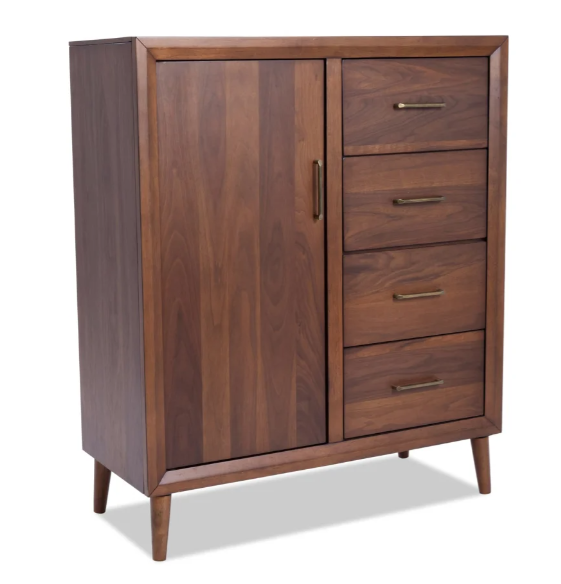

# Test 001: Wood Storage Cabinet

## Source



## Recipe

Use this recipe in Revit:

```text
examples\image-to-recipe-tests\001-wood-storage-cabinet\family_recipe.generated.json
```

## Expected First-Pass Output

The current builder should generate a native Revit Furniture family with:

- Panelized cabinet body with side, top, bottom, and back panels.
- Left double-door front.
- Right four-drawer front.
- Front frame rails and stiles.
- Simple cylindrical brass-colored pulls.
- Four simple rectangular leg placeholders.

## Known Simplifications

- Overall product dimensions were supplied: 42 in wide, 18 in deep, 45 in high.
- Internal component proportions are inferred from the image.
- Wood grain is represented only by material color.
- Angled/tapered legs are simplified as rectangular posts.
- Drawer gaps and bevels are approximate front-panel geometry.
- The family is not parametric yet.

## Test Instructions

1. Restart Revit 2026 after installing the latest add-in.
2. Run `External Tools > Symetri Family Forge - Build Family From Recipe`.
3. Select `family_recipe.generated.json`.
4. Confirm the generated `.rfa` is saved under this test folder's `generated` subfolder.
5. Compare the resulting family against `source-image.png`.
6. Record gaps or observations in `qa-notes.md`.
